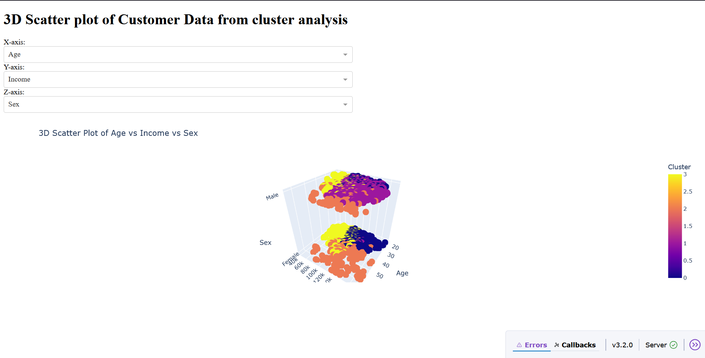

# Dash App for customer segmentation analysis
<!-- TABLE OF CONTENTS -->

## Table of Contents

- [Overview](#overview)
- [Tools](#tools)
- [Contact](#contact)

<!-- OVERVIEW -->

## Overview

In this project, I built a python dash app for customer segmentation analysis from my previous customer segmentation project. The app uses K-Means clustering to segment customers based on their behavior and preferences. This app allows users see the interactions of various features within the customer segments available. The app also allows users to explore the customer segments based on various features.

## Tools

- [Pandas](https://pandas.pydata.org)
- [Plotly](https://plotly.com/python/?_gl=1*1ki74vb*_gcl_au*OTI4MzA2MTkwLjE3NTc0NTQ0MTY.*_ga*NTg3OTQ0NTE3LjE3NTc0NTQ0MTU.*_ga_6G7EE0JNSC*czE3NTc0NTQ0MTYkbzEkZzEkdDE3NTc0NTQ0NDIkajM0JGwwJGgw)
- [Dash](https://dash.plotly.com/?_gl=1*urssjf*_gcl_au*OTI4MzA2MTkwLjE3NTc0NTQ0MTY.*_ga*NTg3OTQ0NTE3LjE3NTc0NTQ0MTU.*_ga_6G7EE0JNSC*czE3NTc0NTQ0MTYkbzEkZzEkdDE3NTc0NTQ1MDEkajM1JGwwJGgw)

## Contact

- GitHub [@Sotun-1010](https://github.com/Sotun-1010)
- Twitter [@O_G_Sotun](https://twitter.com/O_G_Sotun?t=kRiO1YNhYKn8NJJnxTZ42A&s=03)
- Portfolio Site [Ogunjirin Oluwasotun](https://www.datascienceportfol.io/oluwasotunogunjirind)
- Medium [Ogunjirin Oluwasotun Goodness](https://medium.com/@oluwasotunogunjirin)
- Website [Oglytics](https://oglytics.webflow.io/)
